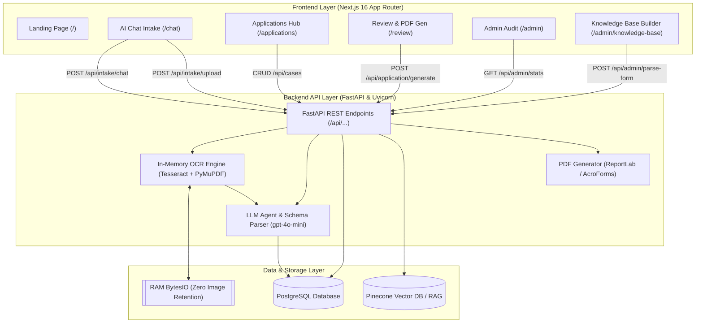

# Passage — AI-Powered Immigration Intake & Form Platform

**Passage** is an enterprise-grade, full-stack immigration automation and intake intelligence platform. Built for applicants, immigration attorneys, and paralegals, Passage transforms bureaucratic, error-prone immigration workflows into a seamless, conversational experience powered by real-time **Optical Character Recognition (OCR)**, **LLM entity extraction**, **cross-application profile unification**, and **automated PDF form population**.

---

## 📑 Table of Contents

- [Platform Overview](#-platform-overview)
- [System Architecture](#-system-architecture)
- [Technology Stack](#-technology-stack)
- [Comprehensive Page-by-Page Documentation](#-comprehensive-page-by-page-documentation)
  - [1. Landing & Portal Entry (`/`)](#1-landing--portal-entry-)
  - [2. Conversational Intake Assistant (`/chat`)](#2-conversational-intake-assistant-chat)
  - [3. Application Portfolio Management (`/applications`)](#3-application-portfolio-management-applications)
  - [4. Unified Profile & PDF Review Hub (`/review`)](#4-unified-profile--pdf-review-hub-review)
  - [5. Admin Audit & Metrics Console (`/admin`)](#5-admin-audit--metrics-console-admin)
  - [6. Admin Knowledge Base & Form Schema Builder (`/admin/knowledge-base`)](#6-admin-knowledge-base--form-schema-builder-adminknowledge-base)
  - [7. Dashboard Layout & Navigation Layer](#7-dashboard-layout--navigation-layer)
- [Data Models & Schema Reference](#-data-models--schema-reference)
- [Backend API Specification](#-backend-api-specification)
- [Security & Zero-Retention Privacy Architecture](#-security--zero-retention-privacy-architecture)
- [Local Installation & Setup Guide](#-local-installation--setup-guide)
- [Deployment & Production Setup](#-deployment--production-setup)
- [License](#-license)

---

## 🌐 Platform Overview

Navigating international visa requirements (e.g., *Canada Express Entry*, *Germany Opportunity Card*, *US O-1 / EB-2 NIW*, *UK Global Talent*) involves dozens of fragmented documents, repetitive forms, and strict regulatory criteria. 

**Passage** solves this by introducing:
1. **Zero-Friction Intake**: Applicants talk to an AI assistant or drop raw document scans/screenshots (`.pdf`, `.png`, `.jpg`, `.jpeg`, `.webp`, `.docx`) directly into chat.
2. **Dual-Layer In-Memory OCR**: Text is parsed in RAM via `PyMuPDF` and `Tesseract-OCR` without saving sensitive images to disk or database.
3. **Cross-Application Profile Unification**: Verified biographical, educational, and employment credentials automatically sync across all applications for that applicant, preventing duplicate data entry.
4. **Dynamic Schema Builder for Admins**: Law firms and admins can upload official government guidelines to auto-generate structured form fields and dynamic intake schemas.
5. **One-Click AcroForm Petition Generation**: Generates compliant, printable petition packages and structured PDF filings.

---

## 🏛️ System Architecture



---

## 🛠️ Technology Stack

| Layer | Technology | Details & Role |
|---|---|---|
| **Frontend Framework** | **Next.js 16 (App Router)** | Server & Client Components, Dynamic Routing, Fast Refresh |
| **Language** | **TypeScript & Python 3.13** | Strict type safety across client UI and backend endpoints |
| **Styling & Design System** | **Tailwind CSS & Material Symbols** | Accessible dark/light mode tokens, custom typography, micro-animations |
| **Markdown Rendering** | **React-Markdown & Remark-GFM** | Rich formatting for AI responses, tables, checklists, and code snippets |
| **Backend Framework** | **FastAPI** | High-performance asynchronous API, auto OpenAPI/Swagger docs |
| **Database & ORM** | **PostgreSQL + SQLAlchemy 2.0** | Relational integrity, JSON column persistence, auto-migrations |
| **OCR & Document Engine** | **Tesseract-OCR v5.4 + PyMuPDF** | Vector text extraction + high-DPI rasterization OCR in ephemeral memory |
| **AI / Entity Extraction** | **OpenAI (`gpt-4o-mini`)** | Anti-hallucination structured JSON extraction and conversational intake |
| **Vector DB (Optional RAG)** | **Pinecone** | Semantic search across immigration policy documents |
| **PDF Generation** | **ReportLab / PyPDF** | Structured summary generation and AcroForm pre-population |

---

## 📄 Comprehensive Page-by-Page Documentation

### 1. Landing & Portal Entry (`/`)
* **File Location**: `frontend/src/app/page.tsx`
* **Target Audience**: Prospective applicants, law firm clients, and visiting administrators.
* **Key Capabilities & Architecture**:
  - **Top Navigation Bar**: Sticky glassmorphic header featuring the Passage brand badge, navigation jump links (`#features`, `#how-it-works`, `#trust`), theme toggle (light/dark mode), and role-based authentication buttons.
  - **Hero Section**: Value proposition headline (*"Immigration paperwork, simplified with artificial intelligence"*), instant call-to-action buttons (*"Start Application"*, *"Explore Live Cases"*), and live trust metrics (99.4% Extraction Accuracy, Zero-Retention Privacy, Multi-Country Schemas).
  - **Interactive Feature Matrix**: Visual cards highlighting Multi-Country Management, Dual-Layer OCR, Zero Image Retention, Dynamic Schema Builder, and Automated AcroForm generation.
  - **3-Step Workflow Showcase**: Interactive visual walkthrough illustrating:
    1. *Chat & Upload* (Natural language dialogue & document attachments).
    2. *Real-Time Extraction* (In-memory OCR + structured verification).
    3. *Review & Generate* (One-click PDF petition compilation).
  - **Security & Zero-Retention Trust Banner**: Detailed breakdown of in-memory processing guarantees and encryption standards.
  - **Role Selection Gate**: Quick-start modal/buttons setting authentication cookies (`role=admin` or `role=client`) for seamless role testing.

---

### 2. Conversational Intake Assistant (`/chat`)
* **File Location**: `frontend/src/app/(dashboard)/chat/page.tsx`
* **Target Audience**: Visa applicants undergoing initial intake or adding supporting documents.
* **Key Capabilities & Architecture**:
  - **Multi-Case Conversation Switcher**: Dropdown bar allowing users to switch between active cases (e.g., Canada Express Entry vs. Germany Opportunity Card) or spawn a new case with one click.
  - **Interactive Chat Interface**:
    - Supports natural language answers, country selection, and visa pathway queries.
    - Full Markdown rendering with formatted checklists, code snippets, tables, and clickable guidance links via [MarkdownView.tsx](file:///d:/work/Passage/frontend/src/app/components/MarkdownView.tsx).
    - Auto-scrolling transcript with distinct styling for applicant messages, AI responses, and document attachment badges.
  - **Dual-Layer OCR File & Screenshot Uploader**:
    - Applicants can drag-and-drop or upload PDFs, passport scans, CVs, and screenshots (`.pdf`, `.png`, `.jpg`, `.jpeg`, `.webp`, `.docx`).
    - Ephemeral upload pipeline sends files to `/api/intake/upload`, triggering in-memory Tesseract OCR.
    - Real-time extraction chips display discovered fields (e.g., `Passport Number`, `Date of Birth`, `Full Name`, `IELTS Score`) directly in the chat stream.
  - **Live Intake Progress & Requirement Sidebar**:
    - Visual progress circle and completeness percentage.
    - Real-time **Extracted Fields** list showing verified key-value pairs.
    - Real-time **Missing Required Fields** checklist dynamically updated as data is extracted.
    - One-click shortcut to `/review?case_id={id}` once intake requirements are satisfied.
  - **Responsive Dual-Tab View on Mobile**: Mobile toggle switching between *Chat Stream* and *Extracted Data Checklist*.

---

### 3. Application Portfolio Management (`/applications`)
* **File Location**: `frontend/src/app/(dashboard)/applications/page.tsx`
* **Target Audience**: Applicants managing multiple visa petitions or paralegals overseeing client files.
* **Key Capabilities & Architecture**:
  - **Application Overview Cards**: Summary cards showing total active applications, completed petitions, in-progress cases, and average readiness score.
  - **Search & Multi-Dimensional Filtering**: Real-time search bar filtering across Case IDs, visa types, and country names, accompanied by dynamic country filter chips.
  - **Application Grid & List Views**:
    - Case badge displaying Case ID, target country flag/icon, visa pathway, and submission status (`DRAFT`, `IN_REVIEW`, `READY_FOR_FILING`, `SUBMITTED`).
    - Visual progress bar showing document readiness percentage.
    - Number of extracted fields vs. remaining missing items.
  - **Interactive Application Modal Editor**:
    - Edit target country, visa category, and lifecycle status.
    - Full key-value field editor: add new custom fields, update existing values, or remove stale attributes.
    - Direct synchronization with the PostgreSQL `user_cases` table.
  - **Case Deletion & Lifecycle Management**: Safe deletion modal with confirmation dialogs and immediate UI state synchronization.
  - **Quick Action Links**: Instant routing to continue the conversation in `/chat?case_id={id}` or finalize documents in `/review?case_id={id}`.

---

### 4. Unified Profile & PDF Review Hub (`/review`)
* **File Location**: `frontend/src/app/(dashboard)/review/page.tsx`
* **Target Audience**: Applicants and attorneys performing pre-filing compliance audits and generating official petition packages.
* **Key Capabilities & Architecture**:
  - **Case Selector & Dual Audit Tabs**:
    - **Active Case Review Tab**: Granular inspection of all extracted fields specific to the selected application case.
    - **Unified Applicant Profile Tab**: Aggregated master record displaying verified biographical data, credentials, and identity attributes compiled across all historical cases.
  - **Categorized Data Audit Breakdown**:
    - *Biographical & Identity* (Full Legal Name, DOB, Nationality, Passport Number, Issuance/Expiry Dates).
    - *Education & Language Proficiency* (Highest Degree, Major/Field, University, IELTS/TOEFL/CELPIP Scores).
    - *Work Experience & Financials* (Current Job Title, Years of Experience, NOC/SOC Code, Proof of Funds).
    - *Visa & Pathway Parameters* (Country Code, Visa Class, Filing Timeline).
  - **Legal Verification Checkbox**: Pre-generation compliance confirmation safeguard requiring attorney/applicant sign-off.
  - **One-Click AcroForm & PDF Compilation Engine**:
    - Dispatches a request to `/api/application/generate`.
    - Compiles verified case data into a styled, downloadable immigration petition summary PDF.
    - Direct in-browser download button with filename versioning.

---

### 5. Admin Audit & Metrics Console (`/admin`)
* **File Location**: `frontend/src/app/(dashboard)/admin/page.tsx`
* **Target Audience**: Immigration attorneys, paralegals, system administrators, and compliance officers.
* **Key Capabilities & Architecture**:
  - **Real-Time Analytics Ribbon**: Live counter tiles for Total Active Cases, Pending Audits, Processed Today, and Average Readiness Score.
  - **Comprehensive Case Audit Grid**:
    - Master table listing all applicant cases across the organization.
    - Column headers for *Case ID*, *Applicant ID*, *Target Country*, *Visa Pathway*, *Extracted Entities Count*, *Completeness Score*, and *Filing Status*.
    - Visual completeness progress bars and status pill indicators.
  - **Filter & Search Toolbar**: Search by Case ID/Applicant and filter dynamically by Country and Visa classification.
  - **Case Inspection & Management Modals**:
    - Inspect full raw JSON payloads, extracted dictionary items, and missing requirement logs.
    - Modify application status and delete abandoned or test records.
  - **Direct Bridge to Knowledge Base Builder**: Quick-access shortcut to define new visa schemas.

---

### 6. Admin Knowledge Base & Form Schema Builder (`/admin/knowledge-base`)
* **File Location**: `frontend/src/app/(dashboard)/admin/knowledge-base/page.tsx`
* **Target Audience**: Immigration lawyers and administrators configuring new visa programs and intake schemas.
* **Key Capabilities & Architecture**:
  - **AI-Powered PDF Guideline Parser**:
    - Upload official government immigration guidelines, manual checklists, or PDF forms.
    - Triggers the `/api/admin/parse-form` endpoint which executes in-memory OCR followed by LLM schema extraction.
    - Automatically deduces required fields, data types (`string`, `number`, `date`, `boolean`), and requirement flags.
  - **Interactive Schema Builder & Field Customizer**:
    - Add, edit, or remove fields extracted by the AI engine.
    - Specify Country Code (e.g., Canada, Germany, US, UK, Australia) and Visa Classification.
    - Set field validation rules and mark items as required or optional.
  - **Schema Repository & Template Hub**:
    - Browse all saved country and visa schemas stored in the `country_schemas` table.
    - Inspect schema versions, total field counts, and JSON configurations.
    - Delete deprecated schemas or clone existing templates.
  - **Pre-Seeded Universal Schema Library**: Comes pre-configured with industry-standard templates for Canada Express Entry, Germany Opportunity Card, US O-1 Extraordinary Ability, US H-1B, and UK Skilled Worker.

---

### 7. Dashboard Layout & Navigation Layer
* **File Locations**: `frontend/src/app/(dashboard)/layout.tsx` & `frontend/src/app/(dashboard)/components/MobileNav.tsx`
* **Key Capabilities & Architecture**:
  - **Responsive Dual-Navigation Architecture**:
    - **Desktop Sidebar (`md:flex`)**: Persistent navigation drawer with brand header, categorized link groups (*Applicant Portal* vs. *Admin Console*), live PostgreSQL database connection heartbeat pill, dark/light theme switch, and user profile card.
    - **Mobile Bottom Navigation Bar (`md:hidden`)**: Touch-optimized bottom navigation with active route highlights, icon badges, and smooth transitions.
  - **Live Database Status Indicator**: Real-time visual badge confirming active database connectivity.

---

## 🗄️ Data Models & Schema Reference

### 1. `UserCaseState` (`user_cases` table)
Tracks an individual visa application case for an applicant.

| Column | Type | Description |
|---|---|---|
| `case_id` | `VARCHAR` (PK) | Unique case identifier (e.g. `APP-1001`) |
| `user_id` | `VARCHAR` (Indexed) | Identifier of the applicant/user |
| `target_country` | `VARCHAR` | Destination country (e.g. `Canada`, `Germany`, `United States`) |
| `visa_type` | `VARCHAR` | Visa pathway (e.g. `Express Entry`, `Opportunity Card`) |
| `status` | `VARCHAR` | Case state: `DRAFT`, `IN_REVIEW`, `READY_FOR_FILING`, `SUBMITTED` |
| `extracted_data` | `JSON` | Key-value dictionary of verified extracted entities |
| `missing_fields` | `JSON` | Array of field names still required by the target visa schema |
| `uploaded_documents` | `JSON` | Metadata log of processed documents (file names, extraction timestamps) |
| `chat_history` | `JSON` | Array of conversational turns `[{ role, text, isAttachment, timestamp }]` |

### 2. `CountrySchema` (`country_schemas` table)
Stores the master form requirement templates used by the AI intake engine to validate and prompt applicants.

| Column | Type | Description |
|---|---|---|
| `country_code` | `VARCHAR` (PK) | Country name or ISO code (e.g. `Canada`, `Germany`) |
| `visa_type` | `VARCHAR` (PK) | Specific visa subclass (e.g. `Express Entry`, `Opportunity Card`) |
| `version` | `VARCHAR` | Schema version string (e.g. `v1.0`, `2026.1`) |
| `required_fields` | `JSON` | Array of field definition objects `[{ id, name, type, required }]` |

---

## 🔌 Backend API Specification

### Case Management Endpoints
* `GET /api/cases`: Retrieve all active application cases with calculated completeness percentages.
* `POST /api/cases/new`: Create a new application case, automatically pre-populated from the user's Unified Profile.
* `GET /api/cases/{case_id}`: Retrieve full case details, chat history, extracted entities, and missing fields.
* `PUT /api/cases/{case_id}`: Update application country, visa type, status, or extracted key-value fields.
* `DELETE /api/cases/{case_id}`: Permanently delete an application case and its associated intake history.
* `GET /api/user/profile`: Aggregate verified credentials across all user cases into a **Unified Applicant Profile**.

### Intake & OCR Endpoints
* `POST /api/intake/chat`: Send a conversational message to the intake assistant; updates state and prompts for missing fields.
* `POST /api/intake/upload`: Ephemeral multipart document/screenshot upload. Executes in-memory OCR, runs LLM entity extraction, updates `extracted_data`, and recalculates `missing_fields`.

### Admin & Knowledge Base Endpoints
* `GET /api/admin/stats`: Get aggregated system metrics (active cases, pending reviews, processed documents).
* `GET /api/admin/cases`: List all cases across all users for attorney audit.
* `GET /api/admin/forms`: List all saved country and visa schemas.
* `POST /api/admin/parse-form`: Upload an official guideline PDF to automatically extract requirement fields via OCR + LLM.
* `POST /api/admin/save-form`: Persist a new or modified visa form schema to PostgreSQL.
* `DELETE /api/admin/forms/{country}/{visa}`: Delete a custom form schema.

### PDF Petition Generation
* `POST /api/application/generate`: Generate a formatted, submission-ready immigration summary PDF from case data.

---

## 🔒 Security & Zero-Retention Privacy Architecture

1. **Zero Image Retention Policy**:
   - All uploaded passport scans, identity documents, and CV screenshots are read strictly into ephemeral in-memory byte streams (`io.BytesIO`).
   - Bitmaps and PDFs are processed in RAM by Tesseract-OCR and PyMuPDF, and discarded immediately after text extraction.
   - **No user images, photos, or raw document scans are ever written to disk or stored in the database.**
2. **Schema-Bounded Anti-Hallucination Guardrails**:
   - The LLM intake engine operates strictly in JSON mode constrained by the destination country's `CountrySchema`.
   - The AI is instructed never to invent dates, credentials, or test scores. If an entity is not explicitly detected in OCR or user statements, it remains in `missing_fields`.
3. **Relational Data Isolation**:
   - Applicant state is structured with foreign-key isolation and validated via Pydantic schemas.

---

## 🚀 Local Installation & Setup Guide

### Prerequisites
* **Node.js**: v18.0.0 or higher
* **Python**: v3.10 to v3.13
* **PostgreSQL**: Local server or Docker container
* **Tesseract-OCR**:
  * **Windows**: `winget install UB-Mannheim.TesseractOCR` (or install to `C:\Program Files\Tesseract-OCR\tesseract.exe`)
  * **macOS**: `brew install tesseract`
  * **Linux (Ubuntu/Debian)**: `sudo apt-get update && sudo apt-get install -y tesseract-ocr`

---

### 1. Clone & Configure Environment
Create a `.env` file in the project root:

```env
# PostgreSQL Database Configuration
DB_HOST=127.0.0.1
DB_PORT=5432
DB_NAME=postgres
DB_USER=postgres
DB_PASSWORD=your_postgres_password

# OpenAI API Key (Required for LLM extraction and conversational intake)
OPENAI_API_KEY=sk-proj-your-openai-key-here

# Pinecone Vector DB (Optional for RAG knowledge search)
PINECONE_API_KEY=your_pinecone_api_key
PINECONE_INDEX=immigration-kb
```

---

### 2. Backend Setup
```bash
# Navigate to backend directory
cd backend

# Create Python virtual environment
python -m venv venv

# Activate virtual environment
# Windows:
venv\Scripts\activate
# macOS/Linux:
source venv/bin/activate

# Install Python dependencies
pip install -r requirements.txt

# Start FastAPI server
uvicorn main:app --reload --port 8000
```
Backend Swagger documentation will be available at [http://127.0.0.1:8000/docs](http://127.0.0.1:8000/docs).

---

### 3. Frontend Setup
```bash
# Open a new terminal and navigate to frontend directory
cd frontend

# Install Node dependencies
npm install

# Start Next.js development server
npm run dev
```
Open [http://localhost:3000](http://localhost:3000) in your browser.

---

## 🐳 Deployment & Production Setup

### Docker Deployment
The included `Dockerfile` packages both the Next.js frontend, the FastAPI backend, and the native `tesseract-ocr` binary into a single production container:

```bash
# Build Docker image
docker build -t passage-app .

# Run Docker container
docker run -p 8000:8000 -p 3000:3000 --env-file .env passage-app
```

### Render Deployment
The project includes a `render.yaml` blueprint for automatic deployment on Render with managed PostgreSQL and web service configuration.

---

## 📜 License

Passage is licensed under the **MIT License**. Copyright © 2026 Passage Immigration AI.
